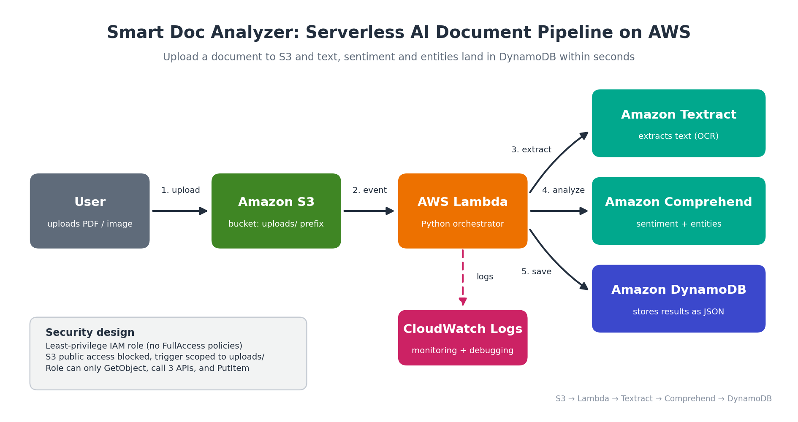
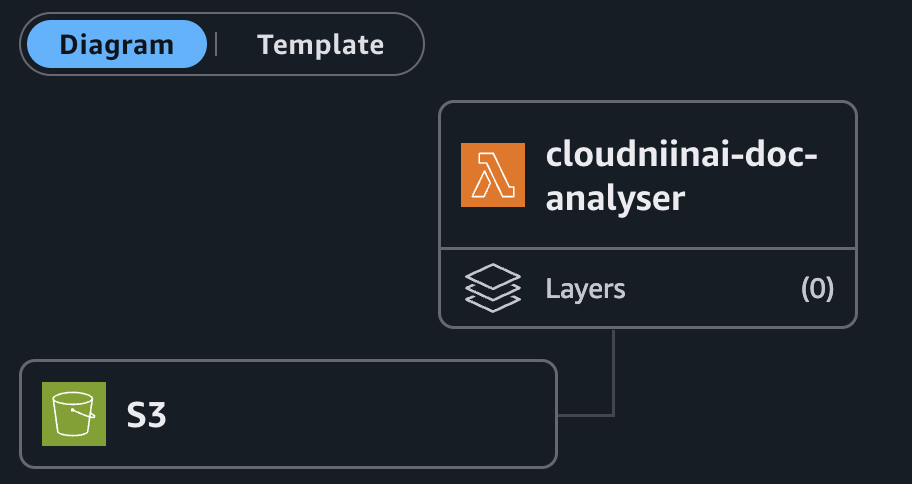
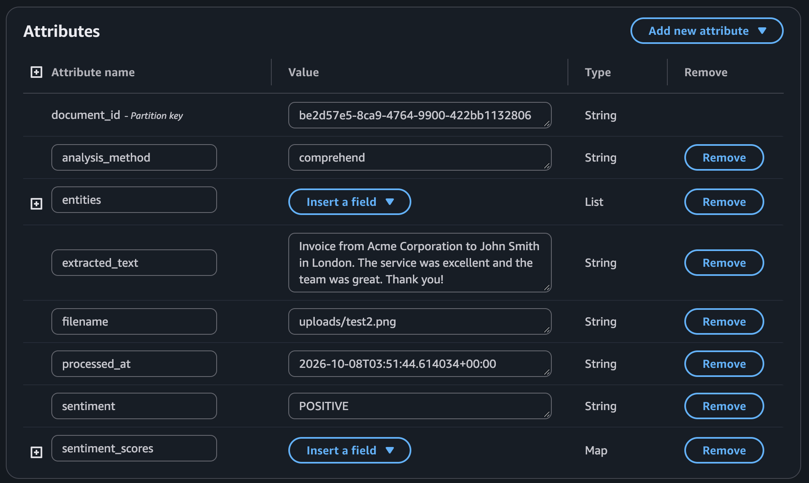
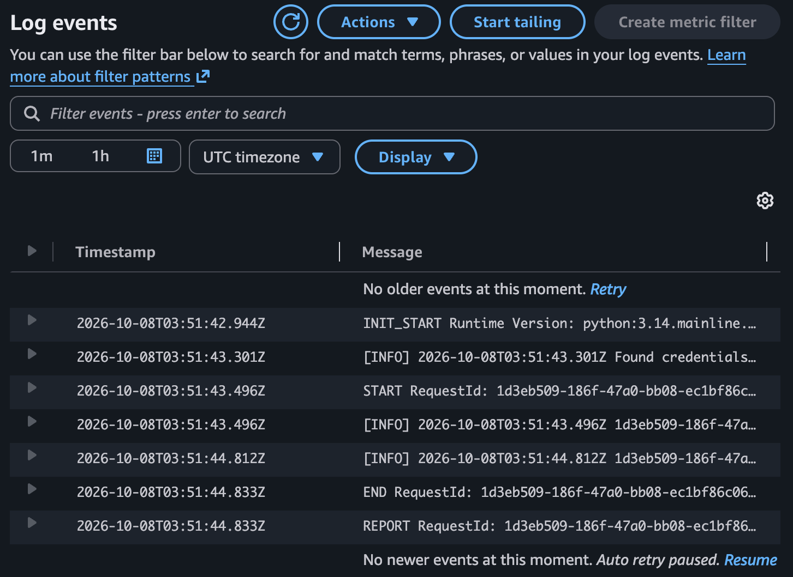

# Smart Doc Analyzer — Serverless AI Document Pipeline on AWS

Upload a PDF or image to S3 and, within seconds, its text, sentiment and named entities are extracted and stored in DynamoDB. No servers to manage.



```
S3 (uploads/)  ->  Lambda (Python 3.12 or newer)  ->  Textract (OCR)
                                         ->  Comprehend (sentiment + entities)
                                         ->  DynamoDB (results)
```

## Tech stack
Amazon S3 · AWS Lambda · Amazon Textract · Amazon Comprehend · Amazon DynamoDB · IAM · CloudWatch

## How it works
1. A file lands in `uploads/` and S3 fires an event to Lambda.
2. Lambda calls Textract `DetectDocumentText` to extract text lines.
3. Lambda calls Comprehend for sentiment and the top 10 entities (or a free rule-based fallback via `ANALYSIS_MODE=python`).
4. The result is written to DynamoDB (`document_id` partition key).

## Engineering decisions
- **Least-privilege IAM**: custom policy in [`iam/lambda-policy.json`](iam/lambda-policy.json) instead of `*FullAccess` managed policies.
- **URL-decoded S3 keys**: S3 events encode keys, so filenames with spaces broke the naive version.
- **Byte-aware truncation**: Comprehend limits input by UTF-8 bytes, not characters.
- **Graceful fallback**: if Comprehend is unavailable, the function falls back to a rule-based analyzer and records `analysis_method`.
- **Prefix-scoped trigger** (`uploads/`) to prevent recursive invocations.
- **Structured logging** to CloudWatch for debugging.

## Setup
1. Create an S3 bucket (block public access ON) with an `uploads/` folder.
2. Create DynamoDB table `cloudwithshad-documents`, partition key `document_id` (String), on-demand.
3. Create an IAM role for Lambda using `iam/lambda-policy.json` (fill in placeholders) plus `AWSLambdaBasicExecutionRole`.
4. Create Lambda (Python 3.12 or newer), paste `src/lambda_function.py`, set timeout to 60s, add env vars `TABLE_NAME` and `ANALYSIS_MODE`.
5. Add an S3 trigger: all object create events, prefix `uploads/`.
6. Upload a test file, then check DynamoDB -> Explore items.

## Proof it works
Lambda function with its S3 trigger:



A processed document stored in DynamoDB (extracted text, sentiment, entities, analysis method):



CloudWatch logs for a successful invocation:



## Troubleshooting (real issues I hit while building this)
| Symptom in CloudWatch | Cause | Fix |
|---|---|---|
| `UnsupportedDocumentException` | Textract's synchronous API only accepts JPG, PNG, TIFF or single-page PDFs under 5 MB | Use a supported file, or move to the async API for multi-page PDFs |
| `ClientError ... AccessDenied` on the DynamoDB write | `TABLE_NAME` environment variable was missing, so the code targeted a table the IAM policy does not allow | Set `TABLE_NAME` to the real table name in the Lambda configuration |
| Function never runs | Trigger prefix or event type mismatch, or file uploaded outside `uploads/` | Check the S3 trigger details (prefix `uploads/`, `s3:ObjectCreated:*`) |
| Empty `extracted_text` result | Image contains no readable text | Function returns `no_text` and skips the write |

Useful debugging command: `aws logs tail /aws/lambda/<function-name> --since 1h` prints full log lines.

## Limitations and next steps
- Synchronous Textract handles images and single-page PDFs. Multi-page PDFs need `StartDocumentTextDetection` (async, with SNS).
- Only the first ~5 KB of text is analyzed by Comprehend.
- Next: Infrastructure as Code (AWS SAM/Terraform), a dead-letter queue, and a Bedrock summary step.

## Cost and cleanup
Textract has 1,000 free pages/month for the first 3 months; Comprehend is pay-per-use (cents for testing). Delete the S3 bucket, Lambda, DynamoDB table, IAM role and log group when done.

## Author
Aaron Nii Nai Nai — IT audit / cybersecurity GRC professional moving into cloud. [LinkedIn](www.linkedin.com/in/aaron-nai-07b869259) · [GitHub](https://github.com/Ogyanframa10)
